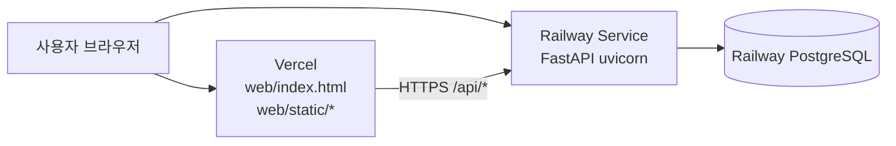

# Railway + Vercel 배포 구조

NCS Search를 **Railway(DB + API)** 와 **Vercel(웹 UI)** 로 나눠 운영할 때의 구조·설정·역할을 정리합니다.

---

## 1. 전체 아키텍처



```text
[사용자]
    │
    ├─► https://your-app.vercel.app          ← 화면 (HTML/JS/CSS)
    │
    └─► https://your-api.up.railway.app      ← API (/api/search, /api/auth, …)
              │
              └─► Railway PostgreSQL (내부 네트워크 또는 DATABASE_URL)
```

| 구성요소 | 플랫폼 | 역할 |
|----------|--------|------|
| **웹 UI** | Vercel | `web/index.html`, `web/static/app.js` 등 정적 파일 |
| **API** | Railway (Service) | FastAPI `app/main.py`, `uvicorn` |
| **DB** | Railway (PostgreSQL) | T11~T30 데이터 |
| **소스** | GitHub | push → Railway / Vercel 자동 배포 |

---

## 2. 배포 방식 두 가지

### A. Railway + Vercel 분리 (이 문서의 목표)

| 장점 | 단점 |
|------|------|
| 프론트 CDN·배포가 빠름 | **CORS**·API URL 설정 필요 |
| API·DB는 Railway에 집중 | `app.js`가 상대 경로 `/api` → 수정 또는 Vercel rewrite 필요 |

### B. Railway 단독 (현재 코드 그대로)

| 장점 | 단점 |
|------|------|
| 코드 수정 거의 없음 (`/` + `/api` 한 서버) | Vercel 미사용 |
| CORS 불필요 | 프론트·API가 같은 도메인 |

**지금 `app.js`는 `/api/...` 상대 경로**라서, Vercel만 쓰면 API 요청이 `vercel.app/api`로 가서 실패합니다.  
분리 배포 시 **아래 4절(필수 코드/설정)** 이 필요합니다.

---

## 3. Railway 프로젝트 구조

하나의 Railway **Project** 안에 서비스 2개를 둡니다.

```text
Railway Project: ncs-search
├── PostgreSQL          ← DB (이미 데이터 Import 중)
└── Web API (Service)   ← GitHub repo, FastAPI만 배포
```

### 3-1. PostgreSQL 서비스

- 스키마: `sql/004_railway_service_schema.sql` (완료 가정)
- 데이터: pgAdmin Import 또는 dump/restore
- **앱 서비스에서 Reference 변수**로 연결 권장

### 3-2. API 서비스 (FastAPI)

| 항목 | 값 |
|------|-----|
| Root Directory | `/` (레포 루트) |
| Start Command | `uvicorn app.main:app --host 0.0.0.0 --port $PORT` |
| Builder | Nixpacks (기본) |

**Environment Variables (API 서비스)**

| Key | 값 | 비고 |
|-----|-----|------|
| `DB_HOST` | `${{Postgres.PGHOST}}` 또는 Connect 호스트 | Reference 권장 |
| `DB_PORT` | `${{Postgres.PGPORT}}` | |
| `DB_NAME` | `${{Postgres.PGDATABASE}}` | 보통 `railway` |
| `DB_USER` | `${{Postgres.PGUSER}}` | |
| `DB_PASSWORD` | `${{Postgres.PGPASSWORD}}` | Secret |
| `JWT_SECRET` | 긴 랜덤 문자열 | **필수** |
| `JWT_ALGORITHM` | `HS256` | |
| `JWT_EXPIRE_MINUTES` | `1440` | |
| `JOB_DESCRIPTION_ORG` | 회사명 | 직무기술서 표지 |
| `CORS_ORIGINS` | `https://your-app.vercel.app` | 분리 배포 시 (코드 반영 후) |

공개 URL 예: `https://ncs-search-api-production.up.railway.app`

**헬스 체크:** `GET /api/health` (또는 health_router 경로)

---

## 4. Vercel 프로젝트 구조

```text
Vercel Project: ncs-search-web
├── Root Directory: (레포 루트 또는 web/ 만 — 아래 vercel.json 참고)
├── Output: 정적 파일 (web/)
└── Environment: VITE_API_BASE 또는 rewrite로 Railway API 연결
```

### 4-1. API 주소 연결 (택 1)

**방법 1 — Vercel Rewrite (코드 수정 최소)**  
브라우저는 `vercel.app/api/...` 로 요청 → Vercel이 Railway로 프록시.

`vercel.json` (레포 루트):

```json
{
  "rewrites": [
    { "source": "/api/(.*)", "destination": "https://YOUR-RAILWAY-API.up.railway.app/api/$1" },
    { "source": "/static/(.*)", "destination": "/web/static/$1" },
    { "source": "/", "destination": "/web/index.html" }
  ]
}
```

**방법 2 — app.js에 API 베이스 URL (권장, 명확함)**  
빌드/런타임에 `window.API_BASE = "https://xxx.up.railway.app"` 주입 후  
`fetch(\`${API_BASE}/api/search/full\`, ...)` 형태로 변경.  
→ Railway API에 **CORS** 허용 필요.

### 4-2. Vercel Environment Variables

| Key | 예시 | 용도 |
|-----|------|------|
| `NEXT_PUBLIC_API_BASE` | 사용 안 함 (Next 아님) | — |
| (rewrite 사용 시) | Railway URL을 vercel.json에 직접 | 배포마다 URL 변경 시 vercel.json 수정 |

---

## 5. 분리 배포 시 필수 코드 작업 (체크리스트)

현재 저장소 기준 **미구현** — Vercel 분리 전에 적용합니다.

| # | 작업 | 파일 |
|---|------|------|
| 1 | FastAPI **CORSMiddleware** (`CORS_ORIGINS` env) | `app/main.py` |
| 2 | `app.js` API 베이스 URL (`/api` → `${API_BASE}/api`) | `web/static/app.js`, `web/index.html` |
| 3 | Railway **공개 URL**을 Vercel rewrite 또는 `API_BASE`에 설정 | Vercel / vercel.json |
| 4 | (선택) Railway DB SSL — 공개 proxy 사용 시 | `app/db.py` `sslmode` |

**CORS 예시 (개념):**

```python
# app/main.py — allow_origins=[os.getenv("CORS_ORIGINS", "http://localhost:8000")]
```

---

## 6. 환경 파일 정리 (로컬 vs 클라우드)

| 파일 | 용도 | git |
|------|------|-----|
| `.env` | 로컬 개발 / 자체 DB(1.218.x) | ignore |
| `.env.railway` | pgAdmin·스크립트로 Railway DB 작업 | ignore |
| `.env.example` | 템플릿 | commit |
| Railway Variables | **운영 API** DB·JWT | 대시보드만 |
| Vercel Env | API URL (방법 2일 때) | 대시보드만 |

**운영 시 API 서비스는 `.env` 파일을 올리지 않고 Railway Variables만 사용합니다.**

---

## 7. 배포 순서 (권장)

```text
1. Railway PostgreSQL 생성 + 004 스키마 + 데이터 Import
2. Railway API 서비스 배포 + Variables + /api/health 확인
3. (분리 시) CORS + app.js API_BASE + vercel.json
4. Vercel 웹 배포 + 브라우저에서 로그인·검색 테스트
5. Vercel 도메인을 CORS_ORIGINS에 추가
```

---

## 8. 보안·연결 요약

| 항목 | 설정 |
|------|------|
| DB | Railway **내부** Reference 변수 — 공개 인터넷에 DB 포트 노출 최소화 |
| JWT | Railway API만 `JWT_SECRET` 보유 |
| CORS | Vercel 도메인만 허용 (와일드카드 `*` 운영 비권장) |
| HTTPS | Vercel·Railway 기본 제공 |

---

## 9. 트러블슈팅

| 증상 | 원인 | 조치 |
|------|------|------|
| Vercel에서 API 404 | rewrite 미설정 | vercel.json `/api` → Railway |
| CORS error | API에 CORS 없음 | `CORS_ORIGINS` + Middleware |
| 로그인 후 401 | JWT/도메인 불일치 | 같은 API URL·쿠키/Authorization 헤더 확인 |
| DB connection fail | Variables 오류 | Postgres Reference 재연결 |
| 검색 안 됨 | T25 비어 있음 | Railway DB `COUNT(*)` 확인 |

---

## 10. 관련 문서

| 문서 | 내용 |
|------|------|
| `docs/DEPLOYMENT_RAILWAY_DB.md` | DB 스키마·CSV Import |
| `docs/DEPLOYMENT.md` | 회사 DB + Railway 단독 (구版) |
| `sql/004_railway_service_schema.sql` | Railway 테이블 생성 |

---

## 11. 한 줄 요약

- **Railway** = PostgreSQL + FastAPI(API)  
- **Vercel** = `web/` 정적 UI  
- **지금 코드**는 Railway **한 곳**에 UI+API 같이 두면 바로 동작  
- **Vercel까지 쓰려면** CORS + API URL(rewrite 또는 `API_BASE`) **추가 작업 필요**

원하시면 다음 단계로 `vercel.json` + CORS + `app.js` API_BASE 패치를 코드에 적용할 수 있습니다.
